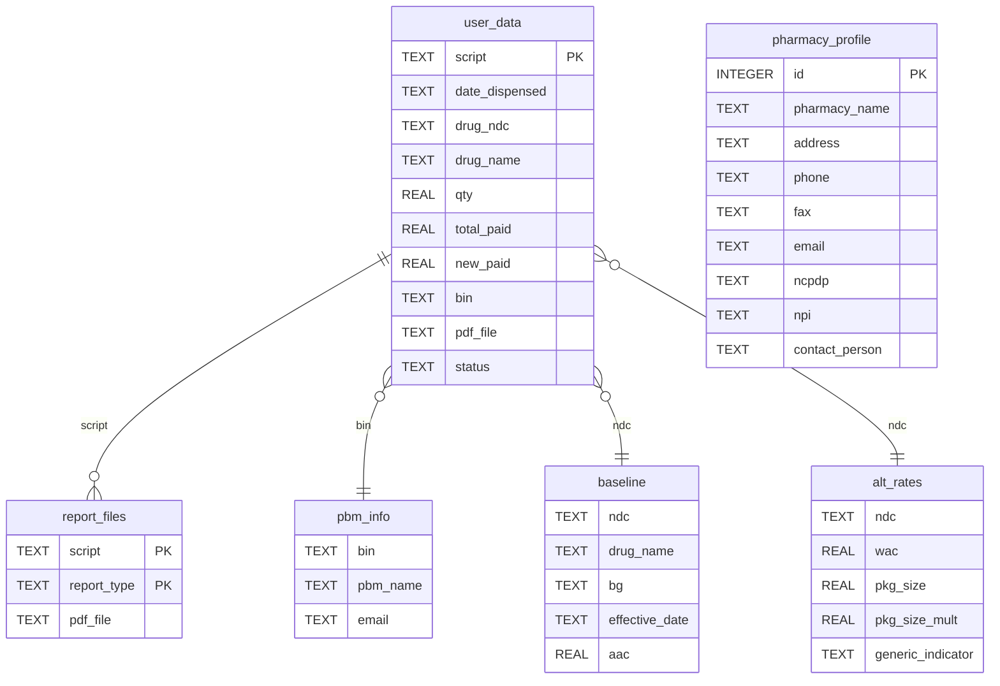

# 🧠 Cyber Pharma Desktop App Recon Report

## 0. Quick Start
- App entry: `pharmacybooks.py` (Tkinter desktop)
- DB: `app.db` (SQLite)
- Inclusion sources: `inclusion_lists/` (AAC, WAC, PBM)
- Reports output: `ReimbursementReports/`
- Run: `python3 pharmacybooks.py`

Requirements are pinned in `requirements.txt`.

---

## 1. Overview of Files
- `pharmacybooks.py` — Main UI/dashboard. Handles Import, filters, KPIs, tabs, Save PDF, Send Email, and Profile dialog. Uses `DatabaseHelper`, `PDFHelper`, `EmailHelper`, `LoginDialog`.
- `helpers/db_helpers.py` — SQLite schema creation, auth (`users`), and loaders for: `inclusion_AAClist.xlsx` → `baseline`, `inclusion_WACMckFullLoad.csv` → `alt_rates`, `inclusion_PBMlist.xlsx` → `pbm_info`. Also provides data helpers.
- `helpers/pdf_helpers.py` — ReportLab PDF generator. Emits per-tab PDFs under `ReimbursementReports/<folder>/`.
- `helpers/email_helpers.py` — Email composition. Tries Outlook COM; fallback writes `.eml` drafts with attachments in `ReimbursementReports/`.
- `helpers/login_dialog.py` — Login/Register dialog (local user store in SQLite).
- `safe_filename.py` — Filename sanitizer.
- `inclusion_lists/` — Source master data files:
  - `inclusion_AAClist.xlsx` (AAC)
  - `inclusion_WACMckFullLoad.csv` (WAC, package size/multiplier, generic indicator)
  - `inclusion_PBMlist.xlsx` (BIN → PBM name + email)
- `ReimbursementReports/` — Output: PDFs and `.eml` drafts (email attachments/drafts).
- `app.db` — Local SQLite database.
- `requirements.txt` — Python dependencies.

Classification:
- UI: `pharmacybooks.py`, `helpers/login_dialog.py`
- DB/Logic: `helpers/db_helpers.py`, `app.db`
- Parsing/Ingestion: `pharmacybooks.py` (import), `helpers/db_helpers.py` (loaders)
- PDF: `helpers/pdf_helpers.py`
- Email: `helpers/email_helpers.py`

---

## 2. Database Schema (SQLite)
Tables discovered (row counts observed in this repo's `app.db` may vary):

- `user_data` — 7427 rows
  - Columns: `script` (PK), `date_dispensed`, `drug_ndc`, `drug_name`, `qty` REAL, `total_paid` REAL, `new_paid` REAL, `bin`, `pdf_file`, `status`
  - Purpose: Imported claim rows. `script` is the unique claim key.

- `baseline` — 20295 rows
  - Columns: `ndc`, `drug name`, `bg`, `effective date`, `aac` REAL
  - Purpose: AAC reference rates by NDC.

- `alt_rates` — 38869 rows
  - Columns: `ndc`, `wac` REAL, `pkg_size` REAL, `pkg_size_mult` REAL, `generic_indicator` TEXT (plus some source extras)
  - Purpose: WAC fallback inputs when AAC missing.

- `pbm_info` — 257 rows
  - Columns: `bin`, `pbm_name`, `email`
  - Purpose: PBM routing and contact email lookup from BIN.

- `report_files` — 699 rows
  - Columns: `script`, `report_type`, `pdf_file` (PK: `script, report_type`)
  - Purpose: Tracks saved report PDF per claim and tab.

- `pharmacy_profile` — 1 row
  - Columns: `id` (1), `pharmacy_name`, `address`, `phone`, `fax`, `email`, `ncpdp`, `npi`, `contact_person`
  - Purpose: Local pharmacy identity.

- `users` — 2 rows
  - Columns: `id`, `username` (UNIQUE), `password_hash`
  - Purpose: Local login for the desktop app.

Relationships (inferred, not FK-enforced):
- `user_data.ndc` → `baseline.ndc` (AAC)
- `user_data.ndc` → `alt_rates.ndc` (WAC fallback)
- `user_data.bin` → `pbm_info.bin` → `pbm_name` + `email`
- `report_files.script` ↔ `user_data.script`

Tenant-scoped data:
- Tenant-specific: `user_data`, `report_files`, `pharmacy_profile`
- Reference data: `baseline`, `alt_rates`, `pbm_info`

Potential unique identifiers:
- `ncpdp`, `npi` (for pharmacy identity)
- `script` (unique claim key)

ERD (Mermaid):

---

## 3. Functional Flow
- Startup (`pharmacybooks.py`):
  - Creates `DatabaseHelper`, loads PBM/AAC/WAC from `inclusion_lists/`.
  - Shows `LoginDialog`; then renders dashboard (tabs and KPIs).
- Import Data (`import_data()`):
  - Choose CSV/XLS/XLSX. Fuzzy header mapping via `resolve_columns()`.
  - Cleans numerics/dates; strips NDC to digits; upserts into `user_data` by `script`.
  - If existing and `total_paid` changed → sets `new_paid` and updates.
- Filters (`fetch_data()`):
  - Date range on `user_data.date_dispensed`.
  - Joins to `baseline`/`alt_rates`/`pbm_info` for AAC/WAC/PBM data.
  - Computes expected/owed/method and applies Underpaid/Overpaid/All and PBM=All|specific|Federal.
- Save PDF (`save_pdf()`):
  - Generates per-tab PDF via `PDFHelper.save_pdf()`, saves under `ReimbursementReports/<folder>/`, records in `report_files`.
- Send Email (`manual_email_dialog()`):
  - Lists saved PDFs for current PBM/tab; composes email with attachments via `EmailHelper`.

---

## 4. Profile Module
- Fields shown: `pharmacy_name`, `address`, `phone`, `fax`, `email`, `ncpdp`, `npi`, `contact_person`.
- Storage: `pharmacy_profile(id=1)`.
- Editable vs locked (recommendation): lock `ncpdp`, `npi`, and potentially `pharmacy_name` after initial set; allow edits to the rest.

---

## 5. File Upload & Ingestion
- Supported:
  - Claims files: `.xlsx`, `.xlsm`, `.xls`, `.csv`.
  - Master inclusions (auto-loaded by app):
    - `inclusion_AAClist.xlsx` → `baseline`
    - `inclusion_WACMckFullLoad.csv` → `alt_rates`
    - `inclusion_PBMlist.xlsx` → `pbm_info`
- Required claim headers (fuzzy-matched): `script`, `total_paid`, `date_dispensed`.
- Optional mapped: `qty`, `drug_ndc`, `drug_name`, `bin`.
- Parsing: numeric cleaning (parentheses/commas), date normalization (YYYY-MM-DD), remove non-digits from NDC.
- Destination: `user_data` with upsert by `script`.

---

## 6. PDF Generation
- Module: `helpers/pdf_helpers.py` (ReportLab).
- Fields in report: Date, Script, Qty, AAC (effective unit rate), Expected, Original Paid, Owed.
- Naming: `{folder}_{pbm}_{start}_{end}.pdf` under `ReimbursementReports/<folder>/`.
- Grouping: Per PBM + date range by the active tab.

---

## 7. Email Process
- Trigger: Send Email button → selection dialog of available PDFs (per PBM/tab).
- Recipient: from `pbm_info.email` (e.g., `NetworkCompliance@express-scripts.com`).
- Subject: `"{PBM} {Tab} Report {start} to {end}"`.
- Body: Plaintext period note; attachments: selected PDFs.
- Delivery: Outlook COM when available; else `.eml` draft created and opened.

---

## 8. Calculations
- Fixed fee: `10.64` (constant `FIXED_FEE`).
- Expected: `expected_paid = qty * aac + FIXED_FEE`.
- Method:
  - If AAC present → `AAC`.
  - Else WAC fallback when `pkg_size>0`, `pkg_size_mult>0`, `wac>0`:
    - If `generic_indicator == 'N'` (brand): `aac = (0.96*wac)/(pkg_size*pkg_size_mult)`.
    - Else: `aac = wac/(pkg_size*pkg_size_mult)`.
- Owed: `difference = total_paid - expected_paid` (negative => underpaid).
- Updated Difference: `updated_diff = new_paid - total_paid`.
- Displayed values are formatted to 2 decimals.

---

## 9. Filters & UI Behavior
- Date: filters `user_data.date_dispensed`.
- PBM: `All` + specific PBMs + `Federal` (no PBM match). 
- Filter: `All`, `Underpaid (difference<0)`, `Overpaid (difference>0)`.
- Buttons visibility: 
  - Save PDF shown when Filter=Underpaid and PBM != All.
  - Send Email shown when PBM not in (All, Federal).

---

## 10. Synthetic Data Readiness
- Minimum fields for claim import: `script`, `total_paid`, `date_dispensed`.
- Recommended to include: `qty`, `drug_ndc`, `bin`.
- Strategy:
  - Sample `ndc` from `baseline`/`alt_rates`.
  - Generate `qty` distributions and `total_paid = qty*rate + fee + noise`.
  - Assign `bin` from `pbm_info` for commercial; leave some unmapped to create Federal.
  - Ensure some `ndc` missing in `baseline` to exercise WAC fallback.

---

## 11. Migration Guidance (Supabase Postgres)
- Table names (prefix `pharma_`):
  - `pharma_user_data` (add `pharmacy_id UUID`; indexes on `date_dispensed`, `drug_ndc`, `bin`)
  - `pharma_baseline` (normalize column names)
  - `pharma_alt_rates`
  - `pharma_pbm_info`
  - `pharma_report_files` (PK `script, report_type`)
  - `pharma_pharmacy_profile` (keyed by `pharmacy_id` or `id`)
  - `pharma_users` (optional; Supabase Auth preferred)
- FKs (recommended):
  - `pharma_user_data(drug_ndc)` → `pharma_baseline(ndc)` (nullable)
  - `pharma_user_data(bin)` → `pharma_pbm_info(bin)` (nullable)
  - `pharma_report_files(script)` → `pharma_user_data(script)`
- Data types:
  - `script` VARCHAR, `date_dispensed` DATE/TIMESTAMPTZ, currency as `NUMERIC(12,2)`.
- RLS (multi-tenant):
  - Add `pharmacy_id UUID` to tenant tables.
  - Enable RLS; policies like `pharmacy_id = auth.uid()` for SELECT/INSERT/UPDATE.
- Migration steps:
  1. Create pharma_* tables (RLS off) with indexes and FKs.
  2. Export from SQLite (CSV or Python) and backfill constant `pharmacy_id` for current tenant.
  3. Bulk import to Supabase.
  4. Enable RLS and add policies.

---

## 12. Questions / Anomalies
- Confirm `script` uniqueness across all periods/vendors.
- Confirm locking rules for `npi`, `ncpdp`, and possibly `pharmacy_name`.
- Decide whether to retain extra columns from the WAC source in Postgres or trim to the essentials.

---

## 13. How to Run Locally
1. Python 3.11+ recommended.
2. Install deps: `pip install -r requirements.txt`.
3. Ensure `inclusion_lists/` files are present.
4. Run: `python3 pharmacybooks.py`.
5. Use "Import User Data" to load claim files (CSV/XLS/XLSX).

Notes:
- Email via Outlook may not work on non-Windows; fallback `.eml` drafts will be created in `ReimbursementReports/`.
- PDFs are written to subfolders under `ReimbursementReports/`.
